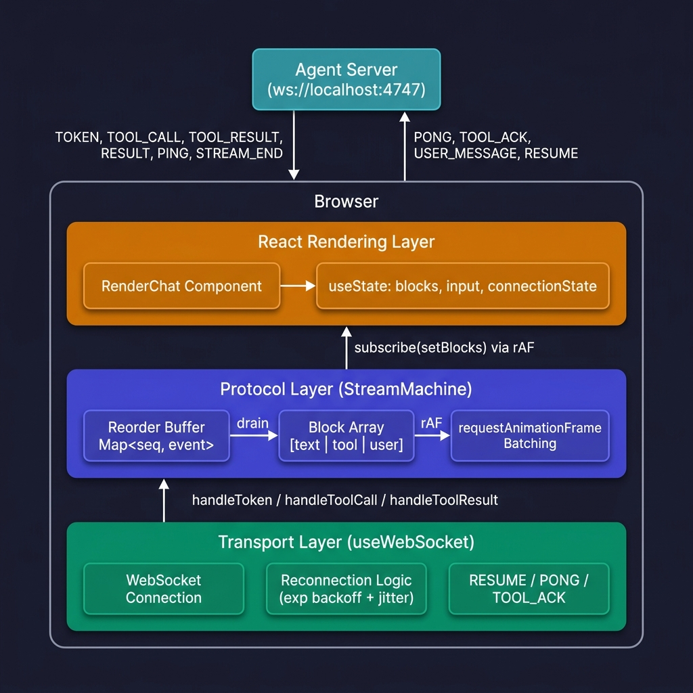
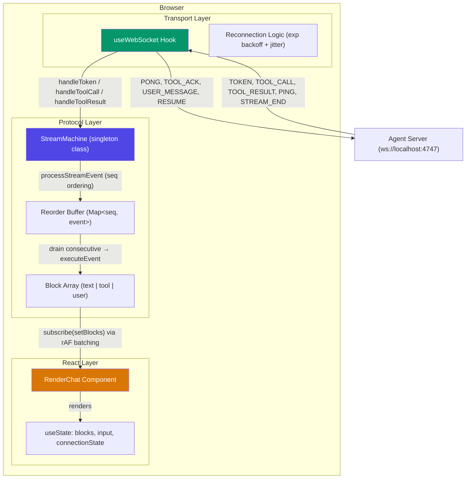
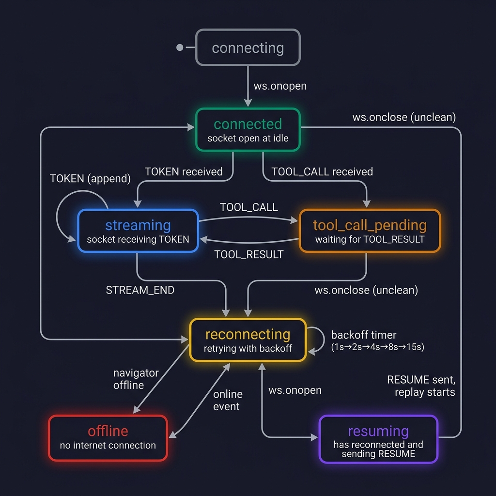
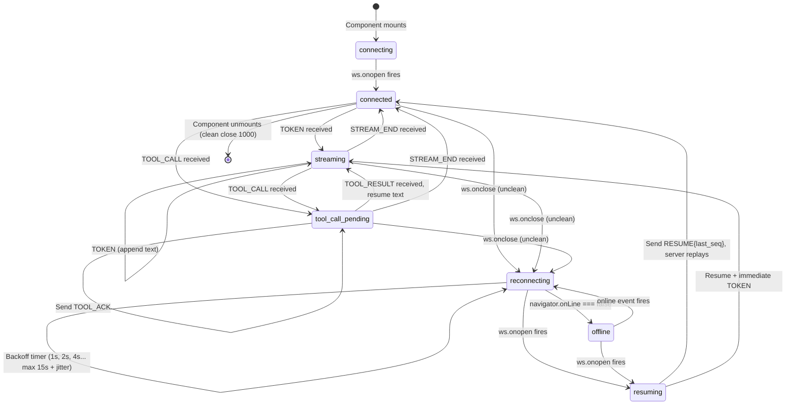

# Stream Engine — Real-Time AI Chat Client

A Next.js WebSocket-based streaming chat frontend that connects to an AI agent server, renders token-by-token responses in real time, handles tool call interruptions, and recovers gracefully from network chaos.

## Architectural Summary

The app is built around a **three-layer separation of concerns**: the WebSocket transport layer (`useWebSocket` hook) handles connection lifecycle, heartbeats, and reconnection; the protocol layer (`StreamMachine` class) manages sequence-based ordering, deduplication, and reorder buffering; and the rendering layer (`RenderChat` component) subscribes to block snapshots and renders them. These layers communicate through clean interfaces — the transport dispatches raw events to the machine, and the machine notifies the UI via a pub/sub subscription. This means a reconnect event never touches the React component tree, and a UI re-render never interferes with socket management.

---

## Architecture Diagram



<details>
<summary>View Mermaid source (for GitHub rendering)</summary>



</details>

---

## WebSocket Connection State Machine



<details>
<summary>View Mermaid source (for GitHub rendering)</summary>



</details>

### State Descriptions

| State | Description |
|-------|-------------|
| **connecting** | Initial WebSocket handshake in progress |
| **connected** | Socket open, idle, waiting for user input or server events |
| **streaming** | Actively receiving TOKEN events, rendering text incrementally |
| **tool_call_pending** | TOOL_CALL received, TOOL_ACK sent, waiting for TOOL_RESULT |
| **reconnecting** | Socket dropped unexpectedly, exponential backoff retry active |
| **offline** | Browser reports no internet (`navigator.onLine === false`) |
| **resuming** | Reconnected, RESUME message sent with `last_seq`, awaiting replay |

---

## Project Structure

```
frontend/
├── src/
│   ├── app/
│   │   ├── page.tsx          # Main chat page, passes WS URL to RenderChat
│   │   ├── layout.tsx        # Root layout with Geist fonts
│   │   └── globals.css       # Tailwind v4 + CSS custom properties
│   │
│   ├── components/
│   │   └── RenderChat.tsx    # Chat UI: message list, input, status indicators
│   │
│   ├── hooks/
│   │   └── useWebSocket.tsx  # WebSocket lifecycle, PONG/ACK, reconnection
│   │
│   ├── lib/
│   │   └── stream-machine.tsx # Core protocol engine: seq ordering, buffering, blocks
│   │
│   └── types/
│       └── index.ts          # TypeScript types: ServerMessage, Block, ToolArgs, ToolResult
│
├── DECISIONS.md              # Technical decisions and tradeoff analysis
├── package.json              # Next.js 16 + React 19 + Tailwind v4
├── tsconfig.json             # Strict TS config with path aliases
└── next.config.ts            # React Compiler enabled
```

---

## How the Data Flows

Here's what happens when a user sends a message and receives a streamed response:

```
1. User types "What is quantum computing?" → clicks Send
                    │
2. RenderChat.handleSend()
   ├── Pushes { type: "user", content: "..." } into StreamMachine.blocks
   ├── Calls resetStreamStateForNewMessage() (clears activeTextBlockId)
   ├── Calls notify() → listeners get updated block snapshot
   └── Calls sendMessage() → WebSocket sends { type: "USER_MESSAGE", content: "..." }
                    │
3. Server starts streaming response
                    │
4. useWebSocket.onmessage receives TOKEN { seq: 1, text: "Quantum", stream_id: "s1" }
   └── Calls machine.handleToken(1, "s1", "Quantum")
       └── processStreamEvent(1, "s1", { type: "text", text: "Quantum" })
           ├── seq === expectedSeq (1) → executeEvent()
           │   └── Creates new text block { id: uuid, type: "text", content: "Quantum" }
           ├── expectedSeq becomes 2
           ├── Drains consecutive buffer (empty, no-op)
           └── notify() → batched via requestAnimationFrame
                    │
5. More TOKENs arrive (seq 2, 3, 4...) → text appended to same block
                    │
6. TOOL_CALL { seq: 8, call_id: "tc1", tool_name: "search", args: {...} }
   ├── useWebSocket sends TOOL_ACK { call_id: "tc1" }
   └── machine.handleToolCall() → new tool block { status: "running" }
                    │
7. TOOL_RESULT { seq: 9, call_id: "tc1", result: {...} }
   └── machine.handleToolResult() → updates tool block to { status: "completed" }
                    │
8. More TOKENs arrive (seq 10, 11...) → new text block created after tool
                    │
9. STREAM_END { stream_id: "s1" }
   └── machine.closeStream("s1") → drains any remaining buffer, clears stream state
```

---

## Protocol Messages

### Client → Server

| Message | When | Purpose |
|---------|------|---------|
| `USER_MESSAGE { content }` | User sends a chat message | Start a new agent response stream |
| `PONG { echo }` | Server sends PING | Heartbeat response to keep connection alive |
| `TOOL_ACK { call_id }` | Server sends TOOL_CALL | Acknowledge tool call receipt |
| `RESUME { last_seq }` | After reconnection | Tell server the last successfully processed seq |

### Server → Client

| Message | Fields | Purpose |
|---------|--------|---------|
| `PING` | `seq`, `challenge` | Heartbeat check |
| `TOKEN` | `seq`, `text`, `stream_id` | Incremental text token |
| `TOOL_CALL` | `seq`, `call_id`, `stream_id`, `tool_name`, `args` | Agent invoked a tool |
| `TOOL_RESULT` | `seq`, `call_id`, `stream_id`, `result` | Tool execution completed |
| `STREAM_END` | `seq`, `stream_id` | Agent finished its response |

---

## Setup and Running Instructions

### Prerequisites

- **Node.js** ≥ 18
- **pnpm** (or npm/yarn — pnpm recommended as the lockfile is included)
- The **agent-server** running on `ws://localhost:4747`

### Quick Start

```bash
# 1. Clone the repo (if not already done)
git clone https://github.com/Omkar2240/Streaming-chat.git

# 2. Install dependencies
pnpm install
# or: npm install

# 3. Start the frontend dev server
pnpm run dev
# App runs at http://localhost:3000
```

see Agent server setup for testing [README.md](agent-server/README.md)

### Production Build

```bash
pnpm run build    # Creates optimized production build
pnpm run start    # Serves production build on http://localhost:3000
```

## Normal Mode Screenshots

### Streamed response with a tool call


### The Trace Timeline


### Environment

No environment variables are required. The WebSocket URL (`ws://localhost:4747/ws`) is hardcoded in `src/app/page.tsx`. To change the server URL, update the `wsUrl` prop:

```tsx
<RenderChat wsUrl="ws://your-server:port/ws" />
```

---

## Key Technical Highlights

### Sequence Reorder Buffer

The `StreamMachine` uses a `Map<number, StreamEvent>` to buffer out-of-order packets and drain them in sequence. Late duplicates are detected and dropped. See `processStreamEvent()` in [stream-machine.tsx](src/lib/stream-machine.tsx).

### Reconnection with Exponential Backoff + Jitter

On disconnect, the client retries with delays of 1s, 2s, 4s, 8s, 15s (capped), plus 30% random jitter to prevent thundering herd. On reconnect, it sends `RESUME { last_seq }` so the server replays only missed events. See [useWebSocket.tsx](src/hooks/useWebSocket.tsx).

### Render Batching

Token updates are coalesced via `requestAnimationFrame`. Even if 20 tokens arrive in a single frame, the UI only paints once with all 20 applied. This prevents render thrashing during high-frequency streaming.

### Layout Stability

Tool call blocks use `min-height: 48px` space reservation, CSS `contain: layout style` for isolated reflow, and stable React keys for DOM node reuse.

### Stale Stream Reaping

A background interval checks every 5 seconds for streams with no activity in the last 60 seconds. Stale streams are force-drained and closed, preventing phantom "thinking..." indicators.

---

## Tech Stack

| Technology | Version | Purpose |
|---|---|---|
| Next.js | 16.2.9 | React framework with App Router |
| React | 19.2.4 | UI rendering with React Compiler enabled |
| TypeScript | 5.x | Type safety (`strict: true`) |
| Tailwind CSS | 4.x | Utility-first styling |
| Geist Font | — | Typography (via `next/font`) |

---

## Chaos Mode Survival

Check video recording: [Youtube](https://youtu.be/vWZytxJzq7g)

The app is designed to survive the agent server's chaos mode, which intentionally:
- Drops WebSocket connections randomly
- Delays packets
- Reorders sequence numbers
- Duplicates messages

The client handles all of these through its reorder buffer, deduplication logic, and reconnection state recovery. See [DECISIONS.md](DECISIONS.md) for detailed documentation of issues found and fixed during chaos testing.
